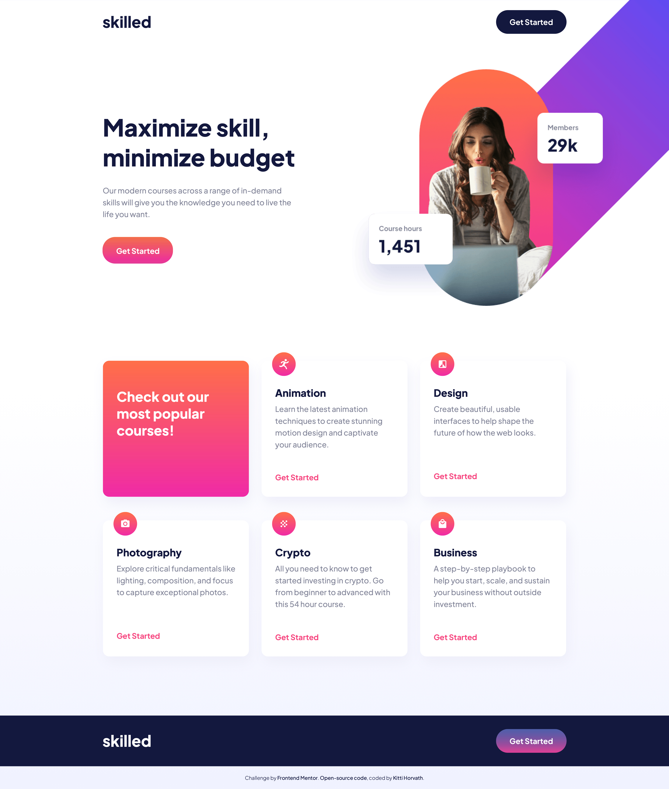

# Skilled e-learning landing page solution

This is a solution to the Skilled e-learning landing page challenge on Frontend Mentor.. Frontend Mentor challenges help you improve your coding skills by building realistic projects.

### The challenge

Users should be able to:

- View the optimal layout depending on their device's screen size
- See hover states for interactive elements

### Screenshot

### Links

- [Solution URL](https://www.frontendmentor.io/solutions/skilled-elearning-landing-page-solution-1nV1oVnMh1)
- [Live site URL](https://lovely-semifreddo-9eb311.netlify.app/)

## My process

### Built with

HTML, CSS, Flexbox, CSS Grid

### What I learned

- It was a good exercise of flexbox and grid.
- I also learned a lot about positioning, and fixing image overflow.

## Author

- Website - [Kitti Horvath](https://www.kittihorvath.com/)
- Frontend Mentor - [@Horv-Kitty](https://www.frontendmentor.io/profile/Horv-Kitty)
